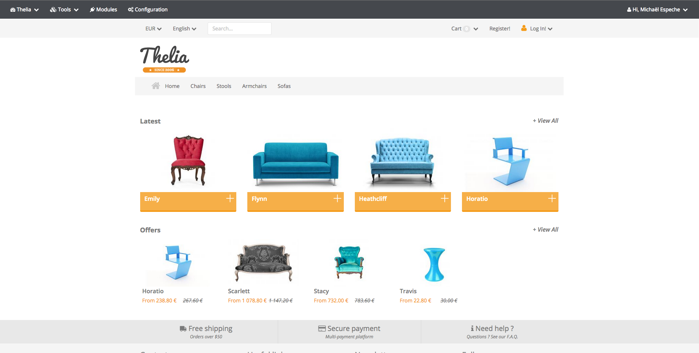

# HookToolbar

HookToolbar add a toolbar on your Front template if you are logged as an administrator. With this toolbar you can directly
the page you are visiting (product, category, folder and content pages) and it creates a shortcut to the admin for the
module page or even the configuration page.



## Installation

### Manually

* Copy the module into ```<thelia_root>/local/modules/``` directory and be sure that the name of the module is HookToolbar.
* Activate it in your thelia administration panel

### Composer

Add it in your main thelia composer.json file

```
composer require thelia/hook-toolbar-module:~1.0
```

## Usage

Activate the module and the toolbar will automatically appears.